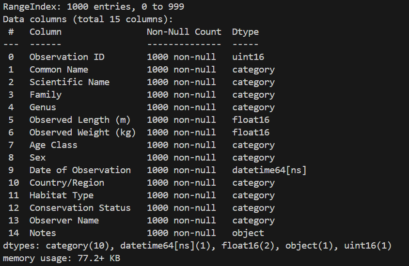

# data_engineering

<a target="_blank" href="https://cookiecutter-data-science.drivendata.org/">
    
</a>

analysis of dataset

## Project Organization

```
├── LICENSE            <- Open-source license if one is chosen
├── Makefile           <- Makefile with convenience commands like `make data` or `make train`
├── README.md          <- The top-level README for developers using this project.
├── data
│   ├── external       <- Data from third party sources.
│   ├── interim        <- Intermediate data that has been transformed.
│   ├── processed      <- The final, canonical data sets for modeling.
│   └── raw            <- The original, immutable data dump.
│
├── docs               <- A default mkdocs project; see www.mkdocs.org for details
│
├── models             <- Trained and serialized models, model predictions, or model summaries
│
├── notebooks          <- Jupyter notebooks. Naming convention is a number (for ordering),
│                         the creator's initials, and a short `-` delimited description, e.g.
│                         `1.0-jqp-initial-data-exploration`.
│
├── pyproject.toml     <- Project configuration file with package metadata for 
│                         data_engineering and configuration for tools like black
│
├── references         <- Data dictionaries, manuals, and all other explanatory materials.
│
├── reports            <- Generated analysis as HTML, PDF, LaTeX, etc.
│   └── figures        <- Generated graphics and figures to be used in reporting
│
├── requirements.txt   <- The requirements file for reproducing the analysis environment, e.g.
│                         generated with `pip freeze > requirements.txt`
│
├── setup.cfg          <- Configuration file for flake8
│
└── data_engineering   <- Source code for use in this project.
    │
    ├── __init__.py             <- Makes data_engineering a Python module
    │
    ├── config.py               <- Store useful variables and configuration
    │
    ├── dataset.py              <- Scripts to download or generate data
    │
    ├── features.py             <- Code to create features for modeling
    │
    ├── modeling                
    │   ├── __init__.py 
    │   ├── predict.py          <- Code to run model inference with trained models          
    │   └── train.py            <- Code to train models
    │
    └── plots.py                <- Code to create visualizations
```

--------
# Download and install Miniconda from official website: [https://docs.conda.io/en/latest/miniconda.html]
# Install Cookiecutter Data Science run VSCode and execute (official website: [https://cookiecutter-data-science.drivendata.org])
`pip install cookiecutter-data-science`
# Answer project creation prompts:
project_name [project_name]: data_engineering
repo_name [data_engineering]: 
author_name [Your name]: Anna Vasilevskaya  
description [A short description of the project]: Dataset analysis from Google Drive
# To download Chocolatey run Windows PowerShell as Administrator and execute:
`Set-ExecutionPolicy Bypass -Scope Process -Force; [System.Net.ServicePointManager]::SecurityProtocol = [System.Net.ServicePointManager]::SecurityProtocol -bor 3072; iex ((New-Object System.Net.WebClient).DownloadString('https://community.chocolatey.org/install.ps1'))`
# To create environment in Terminal execute:
1.	`cd data_engineering`
2.	`make create_enviroment`
3.	`poetry env activate`
4.	`make requirements`
# In VSCode in Terminal execute:
1.	`conda activate base`
2.	`cd. \data_engineering\`
3.	`poetry env activate`
4.	Ctrl+C Ctrl+V file path
# To activate code from data_loader.py execute:
`python -u. \data_engineering\data_loader.py`
# Image for comand `print(raw_data.head(10))`:
.png)
### To save dataset how dataset.parqet execute:
`poetry add pyarrow`
`poetry update package`
### To get information about data type in dataset execute:
`print(raw_data.info())`
# Image for comand `print(raw_data.info())`:

#### Convert data types as needed: replace object with category, downsize int and float types, and change Date of Observation column from object to datetime64[ns]
### To check the changes execute:
`print(raw_data.info())`
# Image for comand `print(raw_data.info())`:

### To save dataset execute:
`raw_data.to_parquet("data/raw/dataset.parquet", index=False)`