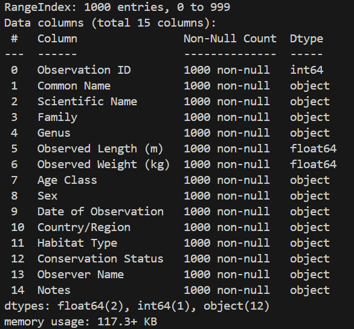

# Download and install Miniconda from official website: [https://docs.conda.io/en/latest/miniconda.html]
# Install Cookiecutter Data Science run VSCode and execute (official website: [https://cookiecutter-data-science.drivendata.org])
`pip install cookiecutter-data-science`
# Answer project creation prompts:
project_name [project_name]: data_engineering
repo_name [data_engineering]: 
author_name [Your name]: Anna Vasilevskaya  
description [A short description of the project]: Dataset analysis from Google Drive
# To download Chocolatey run Windows PowerShell as Administrator and execute:
`Set-ExecutionPolicy Bypass -Scope Process -Force; [System.Net.ServicePointManager]::SecurityProtocol = [System.Net.ServicePointManager]::SecurityProtocol -bor 3072; iex ((New-Object System.Net.WebClient).DownloadString('https://community.chocolatey.org/install.ps1'))`
# To create environment in Terminal execute:
1.	`cd data_engineering`
2.	`make create_enviroment`
3.	`poetry env activate`
4.	`make requirements`
# In VSCode in Terminal execute:
1.	`conda activate base`
2.	`cd. \data_engineering\`
3.	`poetry env activate`
4.	Ctrl+C Ctrl+V file path
# To activate code from data_loader.py execute (experiments):
`python -u .\data_engineering\experiments\data_engineering\data_loader.py`
# Image for command `print(raw_data.head(10))`:
.png)
### To save dataset how dataset.parqet execute:
1. `poetry add pyarrow`
2. `poetry update package`
### To get information about data type in dataset execute:
`print(raw_data.info())`
### Image for command `print(raw_data.info())`:

#### Convert data types as needed: replace object with category, downsize int and float types, and change Date of Observation column from object to datetime64[ns]
### To check the changes execute:
`print(raw_data.info())`
### Image for command `print(raw_data.info())`:

### To save dataset execute:
`raw_data.to_parquet("data/raw/dataset.parquet", index=False)`