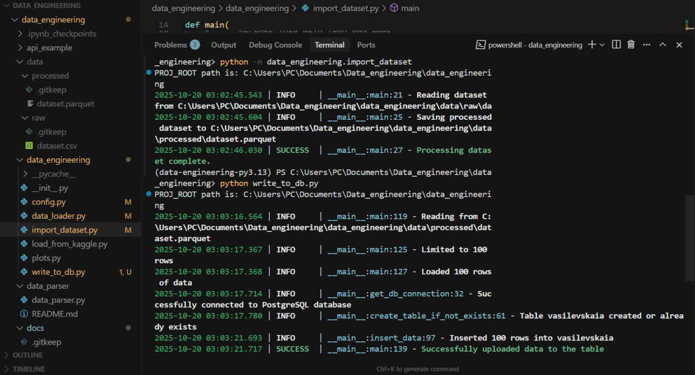
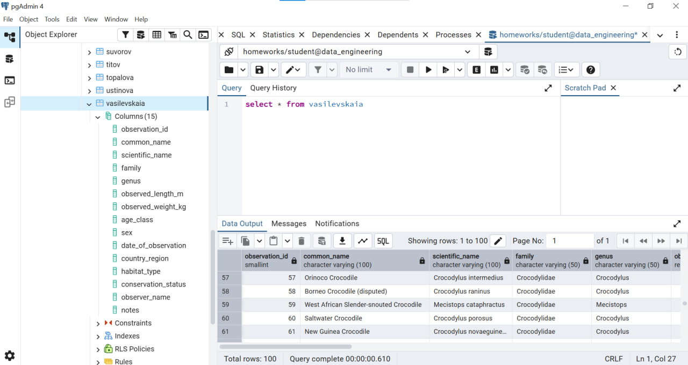
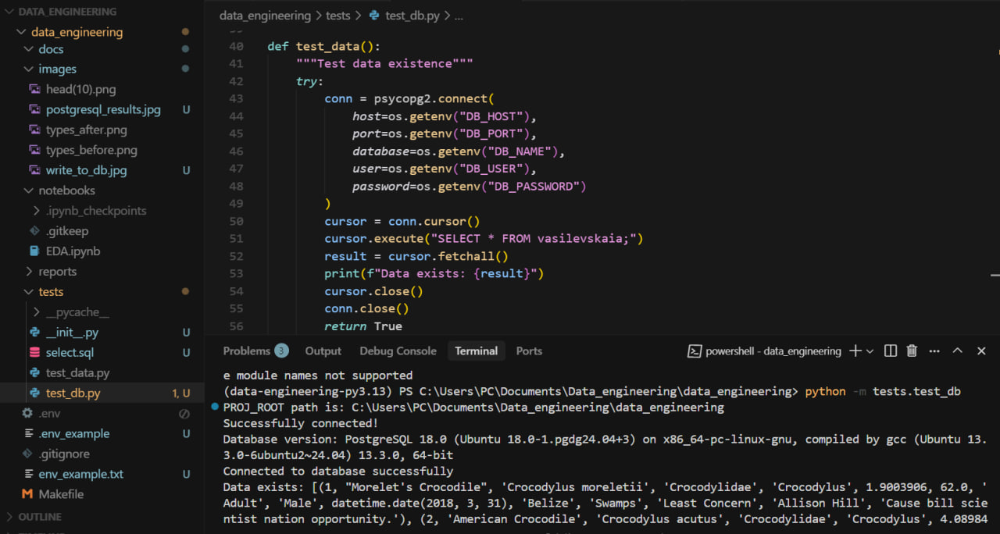

# Connect to PostgreSQL and insert data

Set environment variables:
copy from .env_example to .env and set real values

Other ways:

Windows Command Prompt
```cmd
set DB_HOST=1.2.3.4
set DB_PORT=1234
set DB_NAME=db
set DB_USER=user
set DB_PASSWORD=password
set TABLE_NAME=table
```

Linux/macOS
```bash
export DB_HOST="1.2.3.4"
export DB_PORT="1234"
export DB_NAME="db"
export DB_USER="user"
export DB_PASSWORD="password"
export TABLE_NAME="table"
```

## Execute

1. Dependencies:
```bash
make requirements
poetry env activate
poetry install
```

2. Import data:
```bash
python -m data_engineering.import_dataset
```

3. Upload to database:
```bash
python write_to_db.py
```







